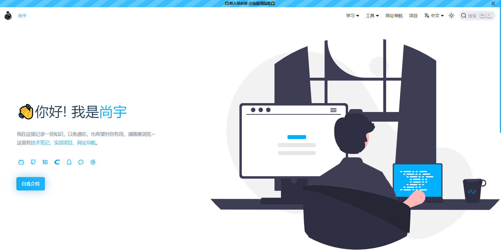
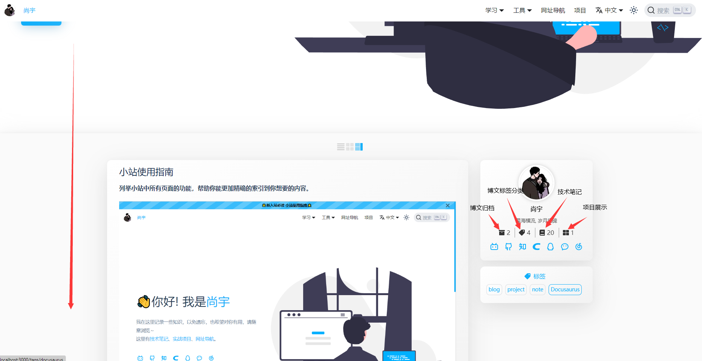
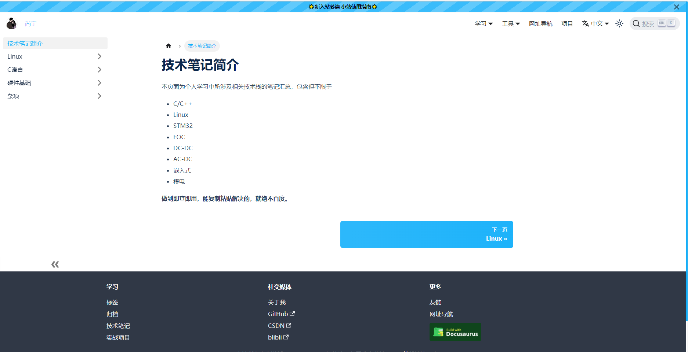
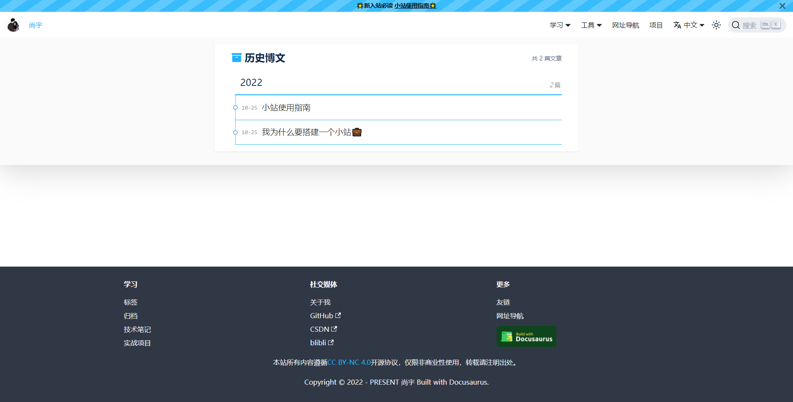
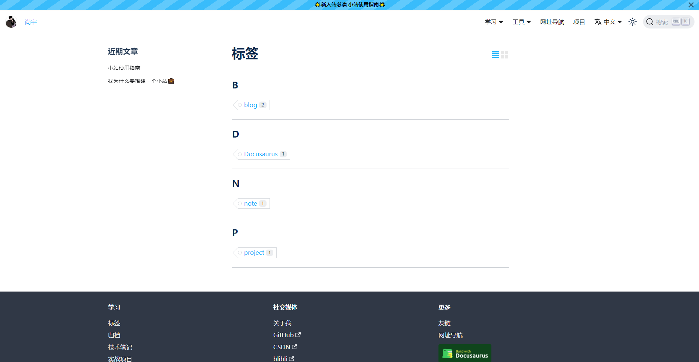
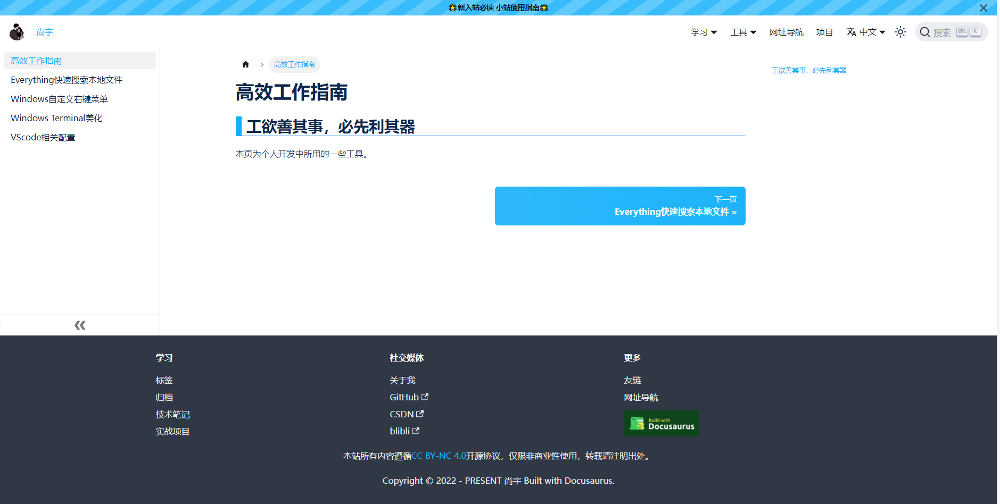
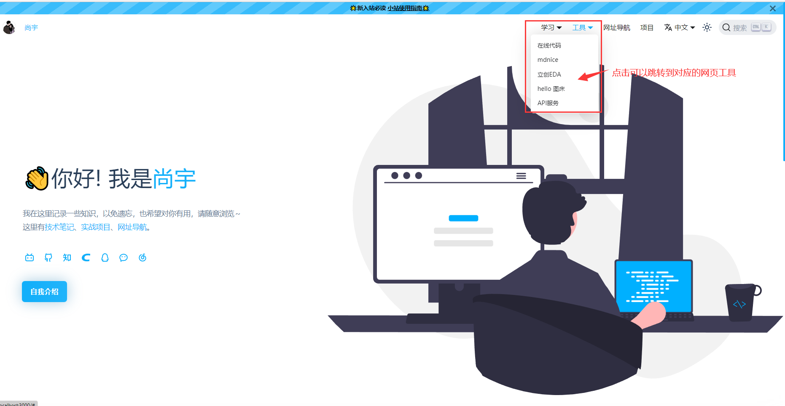
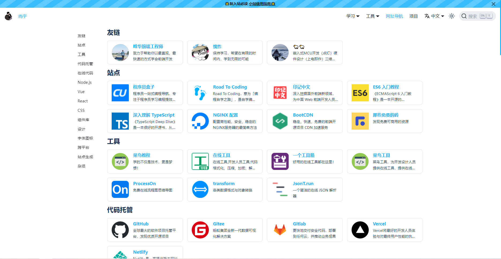
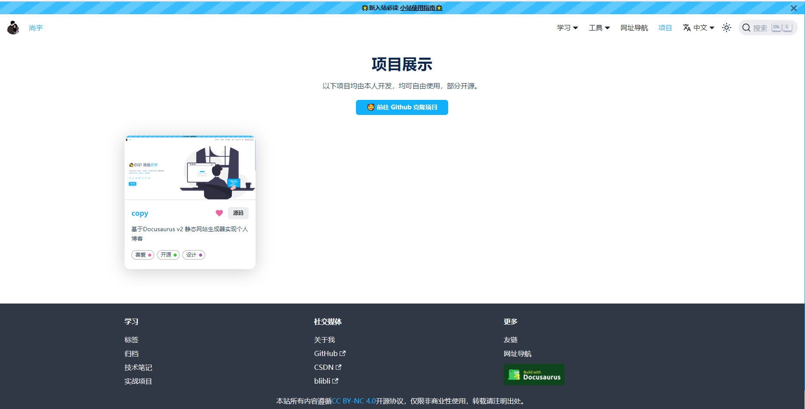

**列举小站中所有页面的功能，帮助你能更加精确的索引到你想要的内容。**

<!-- truncate -->

## 首页下拉可以看到博文哇🤣

这里可选3种查看方式，这里只放了一种😏

## 学习栏的技术笔记页面

存放各种各样的技术笔记

## 学习栏的归档页面

将博文进行时间分类的地方，方便按时间查阅

## 学习栏的标签页面

将博文进行标签分类的地方，方便按关键词标签查阅

## 学习栏的工作指南页面

各种高效开发工具推荐，工欲善其事必先利其器

## 工具栏的网站工具

一些在线工具跳转

## 网址导航

各种各样的网址导航，都是一些很有意思很有用的网站。提高你的学习和开发效率。

## 项目展示

目前只展示了一个项目，其他的我还没有整理，后面再慢慢整理上传。

