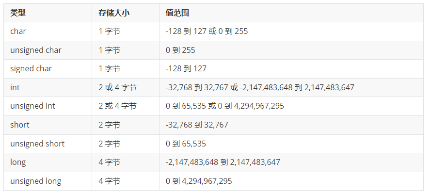
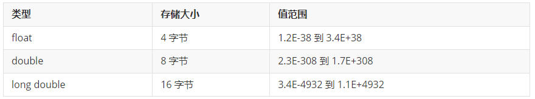
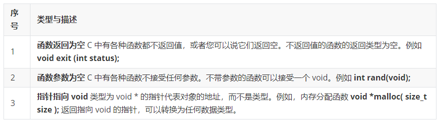
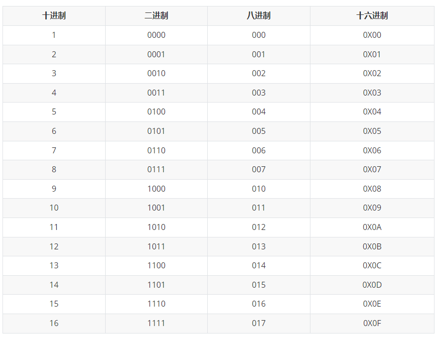
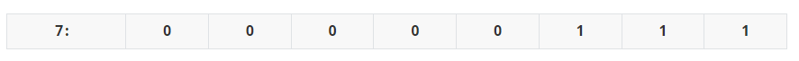
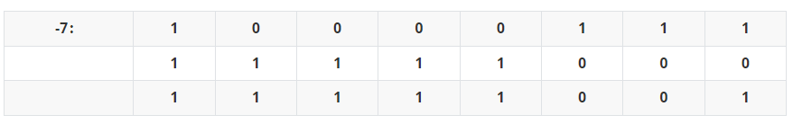
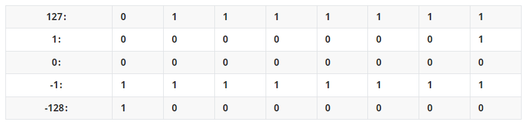

<!-- truncate -->

### 1.基本数据类型

在C语言中，所谓的数据类型就是坑的大小。变量就是在内存里挖一个坑，然后给这个坑命名，数据类型则是这个坑的尺寸大小。

### 2.基本数据类型取值范围

+ 整数类型

+ 浮点类型

### 3.void类型

void类型指定没有任何可用的值。它通常用于以下三种情况下：

### 4.数的表示方式

#### 4.1 比特位和字节

+ CPU能读懂的最小单位（只能存放0和1）—— 比特位，bit，b。
+ 内存机构的最小寻址单位 —— 字节，Byte，B。
+ 1Byte == 8bit。
+ 一个字节可以表示最大的数是：1111 1111。

#### 4.2 二进制、八进制、十进制、十六进制

### 4.3 符号位

+ 存放singned类型的存储单元中，左边第一位表示符号位。
+ 符号位为0，该数为正数，符号位为1，该数为负数。
+ 一个32位的整形变量，除去左边第一位的符号位，剩下表示值的只有31个比特位。

### 4.4 补码

+ 计算机是用补码的形式来存放整数的值。
+ 正数的补码是该数的二进制形式。
+ 负数的补码需要通过以下几步获得。
  + 先取得该数的绝对值的二进制形式。
  + 再将第1步的值按位取反。
  + 最后将第2步的值加1。

正数补码：

负数补码：

### 4.5 二进制表示最大值和最小值

