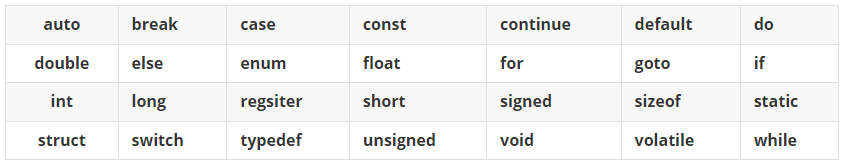
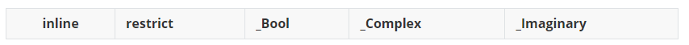
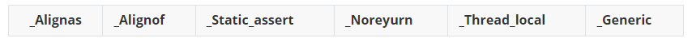
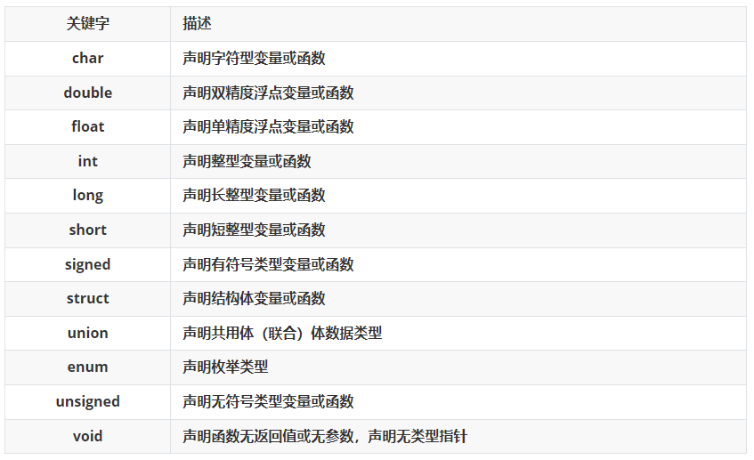
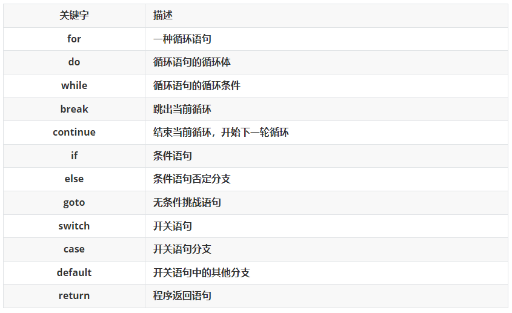
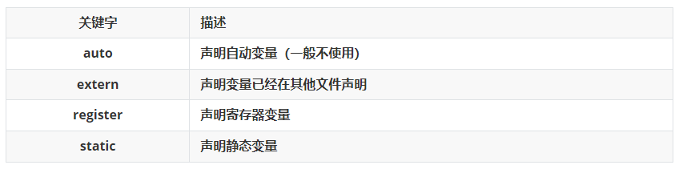
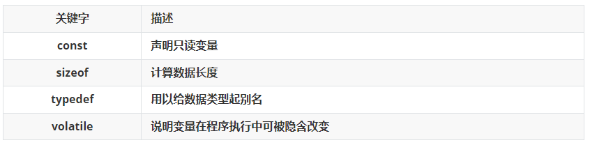

<!-- truncate -->

关键字是C语言内部使用的名字，这些名字具有特殊的含义。

+ 传统的C语言（ANSIC）有32个关键字：

#pic_right/center/left 

+ 1999年，ISO发布C99，添加了5个关键字：

+ 2011年，ISO发布C11，添加了7个关键字：

### 1. 数据类型关键字

### 2. 控制语句关键字

### 3. 存储类型关键字

### 4. 其它类型关键字

